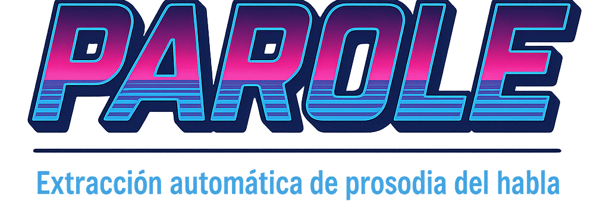

[➡️ English Version](#english)

<p align="center">
  
</p>

<h1 align="center" style="border: none; margin-bottom: 0;">PAROLE</h1>
<h3 align="center" style="margin-top: 0;">Extracción automática de prosodia del habla</h3>

<p align="center">
  <a href="https://doi.org/10.5281/zenodo.15192144">
    
  </a>
  
</p>


## 🛠️ Descripción

**PAROLE** es un pipeline automatizado para la extracción de información prosódica del habla (pitch, intensidad, formantes, harmonicidad, y detección de actividad vocal mediante VAD) desde vídeos. Utiliza herramientas estándar como Praat, Python, R y Silero-VAD, proporcionando resultados en formatos CSV o Parquet.

---

## 📁 Estructura del Proyecto

```
├── data
│   └── videos
│       ├── video_ejemplo1.mp4
│       └── video_ejemplo2.mp4
├── images 
│   └── logo_parole.png
├── install_parole.sh
├── requirements_python.txt
├── resultados
│   └── video_ejemplo1
│       ├── video_ejemplo1_prosody.csv
│       └── video_ejemplo1_prosody.parquet
└── scripts
    ├── extract_prosody.praat
    ├── parole_batch.sh
    ├── parole.sh
    ├── process_prosody.R
    └── silero_vad_runner.py
```

---

## ⚙️ Instalación

Ejecuta en una terminal desde la raíz del proyecto:

```bash
bash install_parole.sh
```

Esto creará los entornos de Python y R necesarios, instalará Praat (versión barren) localmente y configurará todas las dependencias automáticamente.

---

## 🚀 Ejecución

### Procesar un único vídeo

```bash
./scripts/parole.sh data/videos/tu_video.mp4 resultados/ --parquet
```

### Procesar múltiples vídeos (batch)

```bash
./scripts/parole_batch.sh data/videos/ resultados/ --parquet
```

---

## 📖 Dependencias clave

Este proyecto requiere las siguientes herramientas y librerías en distintos entornos:

- **Praat** — Interfaz de línea de comandos (CLI), incluye la versión *barren* utilizada para la extracción prosódica  
- **FFmpeg / FFprobe** — Para la gestión de audio/vídeo y alineación de timestamps

### 🐍 Python

- [`torch`](https://pytorch.org/) — Librería principal de deep learning usada por Silero VAD  
- [`torchaudio`](https://pytorch.org/audio/stable/) — Utilidades de procesamiento de audio para PyTorch  
- [`pandas`](https://pandas.pydata.org/) — Manipulación y gestión de datos  

### 📦 R

- [`arrow`](https://cran.r-project.org/package=arrow) — Usado para guardar los datos prosódicos finales en formato `.parquet`  


---

## 🔁 GitHub Actions

Este repositorio cuenta con un test automático en GitHub Actions que verifica:

- Instalación del entorno completo (Python, R, Praat)
- Ejecución del script `parole.sh` sobre un vídeo de prueba
- Verificación del archivo de salida en `.parquet`

Para más detalles, consulta el archivo [`main.yml`](.github/workflows/main.yml).

---

## 💬 Contactos

- **Soporte técnico:** [Brian Herreño Jiménez](mailto:brian.herreno@um.es)
- **Información del proyecto MULTIFLOW:** [Cristóbal Pagán Cánovas](mailto:cpcanovas@um.es)

---

## 📜 Licencia

Este proyecto se distribuye bajo la licencia [GPL-3](https://www.gnu.org/licenses/gpl-3.0.html).

---

## 📌 Autoría y financiación

**PAROLE** es un artefacto desarrollado por Daedalus Lab bajo el proyecto MULTIFLOW, financiado por el Ministerio de Ciencia, Innovación y Universidades de España.

---

<a id="english"></a>

[➡️ Versión en Español](#parole-extracción-automática-de-prosodia-del-habla)

# 📌 PAROLE: Automatic Speech Prosody Extraction

## 🛠️ Description

**PAROLE** is an automated pipeline for extracting speech prosodic information (pitch, intensity, formants, harmonicity, and Voice Activity Detection via VAD) from videos. It leverages standard tools like Praat, Python, R, and Silero-VAD, providing results in CSV or Parquet formats.

---

## 📁 Project Structure

```
├── data
│   └── videos
│       ├── video_ejemplo1.mp4
│       └── video_ejemplo2.mp4
├── images
│   └── logo_parole.png
├── install_parole.sh
├── requirements_python.txt
├── resultados
│   └── video_ejemplo1
│       ├── video_ejemplo1_prosody.csv
│       └── video_ejemplo1_prosody.parquet
└── scripts
    ├── extract_prosody.praat
    ├── parole_batch.sh
    ├── parole.sh
    ├── process_prosody.R
    └── silero_vad_runner.py
```

---

## ⚙️ Installation

Run from a terminal at the project's root:

```bash
bash install_parole.sh
```

This will set up necessary Python and R environments, install Praat (barren version) locally, and automatically configure all dependencies.

---

## 🚀 Usage

### Single video processing

```bash
./scripts/parole.sh data/videos/your_video.mp4 resultados/ --parquet
```

### Batch video processing

```bash
./scripts/parole_batch.sh data/videos/ resultados/ --parquet
```

---
## 📖 Key Dependencies

This project requires the following tools and libraries across different environments:

- **Praat** — Command-line interface (CLI), includes the *barren* version used for prosodic extraction  
- **FFmpeg / FFprobe** — For audio/video alignment and timestamp management

### 🐍 Python

- [`torch`](https://pytorch.org/) — Core deep learning library used by Silero VAD  
- [`torchaudio`](https://pytorch.org/audio/stable/) — Audio processing utilities for PyTorch  
- [`pandas`](https://pandas.pydata.org/) — Data handling and manipulation  

### 📦 R

- [`arrow`](https://cran.r-project.org/package=arrow) — Used to write the final prosodic data as `.parquet` files  


---

## 🔁 GitHub Actions

This repository includes an automated test in GitHub Actions that checks:

- Installation of the full environment (Python, R, Praat)
- Execution of the `parole.sh` script on a test video
- Verification of the `.parquet` output file


For more details, see the [`main.yml`](.github/workflows/main.yml) file.

---

## 💬 Contacts

- **Technical support:** [Brian Herreño Jiménez](mailto:brian.herreno@um.es)
- **MULTIFLOW project information:** [Cristóbal Pagán Cánovas](mailto:cpcanovas@um.es)

---

## 📜 License

This project is distributed under the [GPL-3 License](https://www.gnu.org/licenses/gpl-3.0.html).

---

## 📌 Authorship and Funding

**PAROLE** is an artifact developed by Daedalus Lab as part of the MULTIFLOW project, funded by the Ministry of Science, Innovation, and Universities of Spain.

